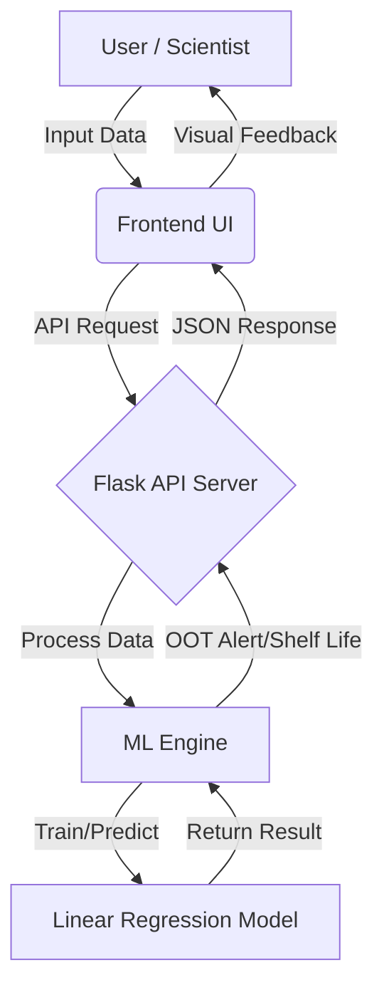

# Implementation Plan: Predictive Stability & OOT Alerting System

## 1. Executive Summary
The goal is to build a Machine Learning-powered web application that analyzes pharmaceutical stability data (Potency, Impurities) to predict shelf-life and detect Out-of-Trend (OOT) results in real-time. This moves stability management from passive recording to active, predictive quality assurance.

## 2. System Architecture

## 3. Technology Stack
*   **Backend**: Python 3.x (Flask)
*   **Machine Learning**: Scikit-Learn (Linear Regression), Pandas, NumPy
*   **Frontend**: HTML5, CSS3 (Glassmorphism), JavaScript (ES6+)
*   **Visualization**: Chart.js
*   **Data Storage**: In-memory (Pandas DataFrame) for prototype; extensible to SQL.

## 4. Module Breakdown

### Module 1: Stability Data Evaluation
*   **Goal**: Visualize historical stability data trends.
*   **Features**:
    *   Interactive Line Charts (Potency vs. Time, Impurities vs. Time).
    *   Data Table view of all recorded points.
    *   Filtering by Study ID (mocked for single study currently).

### Module 2: Predictive Analytics Engine (The Loop)
*   **Goal**: Calculate shelf-life and detect anomalies.
*   **Logic**:
    *   **Shelf-Life**: Uses Linear Regression ($y = mx + c$) to extrapolate the time $x$ when Potency $y$ hits the lower specification limit (e.g., 90%).
    *   **OOT Detection**: Before adding a new point, the model predicts the *expected* value based on previous data. If the *actual* new value deviates by more than a set threshold (e.g., 0.5%), an alert is triggered.

### Module 3: New Study Entry & Alerting
*   **Goal**: Input interface for daily lab results.
*   **Features**:
    *   Form to input `Time Point`, `Potency`, and `Impurities`.
    *   Instant feedback mechanism:
        *   **Green**: Data is within trend.
        *   **Red**: OOT Alert with deviation metrics.

## 5. Step-by-Step Implementation Guide

### Phase 1: Environment Setup (Completed)
1.  Install Python 3.13+.
2.  Create virtual environment.
3.  Install dependencies: `flask`, `pandas`, `scikit-learn`, `numpy`.

### Phase 2: Backend & ML Engine (Completed)
1.  **`ml_engine.py`**:
    *   Created `StabilityModel` class.
    *   Implemented `train()` to fit the regression line.
    *   Implemented `predict_shelf_life()` logic.
    *   Implemented `detect_oot()` to compare residuals against threshold.
2.  **`app.py`**:
    *   Setup Flask routes (`/`, `/api/data`, `/api/predict`).
    *   Connected API endpoints to `StabilityModel` methods.

### Phase 3: Frontend Development (Completed)
1.  **Design**:
    *   Implemented "Glassmorphism" UI using pure CSS (`style.css`).
    *   Created responsive layout with Sidebar and Dashboard grid.
2.  **Interactivity**:
    *   Built `main.js` to handle API calls.
    *   Integrated `Chart.js` for dynamic rendering of stability curves.
    *   Added DOM manipulation for real-time OOT alerts.

### Phase 4: Testing & Optimization
*   **Unit Testing**: Verify OOT logic with known outlier data.
*   **UI Testing**: Ensure charts resize correctly on different screens.

## 6. Future Enhancements (Student Learning Goals)
1.  **Database Integration**: Replace in-memory Pandas DataFrame with SQLite/PostgreSQL to save data permanently.
2.  **Advanced Models**: Implement ARIMA or Prophet for time-series forecasting if data exhibits seasonality.
3.  **Authentication**: Add User Login/Role-management (Scientist vs. Manager).
4.  **Report Generation**: Use `ReportLab` or similar to generate PDF certificates for stability batches.
